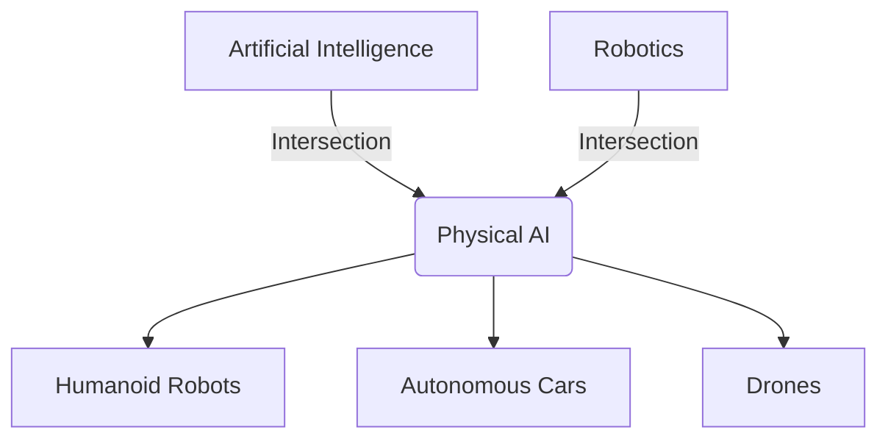

# Introduction to Physical AI & Embodied Intelligence

:::note
Physical AI is the intersection of Digital Intelligence and Physical Action.
:::

## The New Frontier of AI

Artificial Intelligence has historically been confined to digital spaces—servers, clouds, and screens. We've seen LLMs write poetry, generate code, and analyze data at lightning speeds. But there is a frontier that has remained stubbornly difficult: **the physical world**.

**Physical AI** refers to Artificial Intelligence systems that interact with the physical world through sensors and actuators. Unlike a chatbot that lives on a server, a Physical AI agent (like a humanoid robot) must understand gravity, friction, inertia, and the chaotic unpredictability of real-world environments.

### Embodied Intelligence

The concept of **Embodied Intelligence** suggests that intelligence isn't just a function of the brain (or the algorithm) but arises from the interaction between the body, the brain, and the environment.

> "To understand the world, you must be part of it."

A robot isn't just a computer on wheels (or legs). Its physical form constrains and defines its intelligence. A humanoid robot, for instance, is designed to navigate a world built for humans—stairs, door handles, tools, and social spaces.

## Why Humanoid Robots?

Why go through the trouble of building a bipedal robot when wheels are more stable?

1.  **Human-Centric Design**: Our entire infrastructure—from height of tables to width of hallways—is optimized for the human form.
2.  **Versatility**: Legs can traverse terrain that wheels cannot (stairs, rubble, gaps).
3.  **Social Interaction**: A humanoid form facilitates natural social connection and trust.

## Course Overview

In this course, we bridge the gap between digital AI and physical robotics. You will learn to:

*   **Control** robots using **ROS 2** (Robot Operating System), the industry standard for robotics middleware.
*   **Simulate** physics-faithful environments using **Gazebo** and **Unity**.
*   **Train** advanced perception models using **NVIDIA Isaac**.
*   **Deploy** Large Language Models (LLMs) to reason about the physical world (Vision-Language-Action models).

### The Technology Stack

We will be using a cutting-edge stack that mirrors what is used in top robotics labs and companies like Tesla, Boston Dynamics, and Figure AI:

*   **Middleware**: ROS 2 (Humble/Iron)
*   **Simulation**: Gazebo Harmonic, Unity
*   **AI/ML**: NVIDIA Isaac Sim, PyTorch, OpenAI API
*   **Hardware Goals**: Deploying to actual edge devices like NVIDIA Jetson Orin.

## What is a "Digital Twin"?

A Digital Twin is a precise virtual replica of a physical system. In this course, you will build a Digital Twin of a humanoid robot. Before you run code on a $12,000 hardware robot (and risk breaking it), you will test it in a high-fidelity simulation.

If your robot can walk in the simulation without falling, it *might* walk in the real world. If it falls in the simulation, it will *definitely* fall in the real world.

## The Road Ahead

1.  **Module 1**: We start with the nervous system—ROS 2. You'll learn how to pass messages between the robot's "brain" and its "muscles".
2.  **Module 2**: We enter the Matrix. You'll build the physical world inside a computer using Gazebo.
3.  **Module 3**: We add the brain. Using NVIDIA Isaac, we'll implement Visual SLAM (Simultaneous Localization and Mapping) so the robot knows where it is.
4.  **Module 4**: The Capstone. We fuse Vision, Language, and Action to create a robot that can understand commands like "Pick up the red apple" and execute them.

Let's begin our journey into the physical world.
