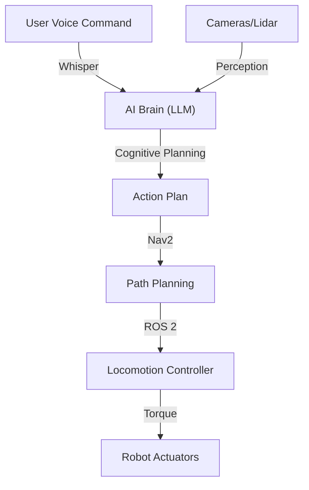

# Foundations of Physical AI: The Embodied Turn

> **"The body uses the mind as a tool to navigate the world."**

Welcome to the **Physical AI & Humanoid Robotics** capstone. In this course, we bridge the gap between the *digital brain* (AI models, LLMs, Computer Vision) and the *physical body* (actuators, sensors, warmth, and weight).

This is not just a robotics course. It is an **AI course** where the API is the real world.

## 1.1 The Great Decoupling is Over

For the last decade, AI progress has been defined by "The Great Decoupling"—the separation of intelligence from the physical world.

*   **GPT-4** can write poetry but cannot make a cup of coffee.
*   **Midjourney** can paint a sunset but cannot screw in a lightbulb.
*   **AlphaGo** can defeat grandmasters but cannot move the Go stones.

This separation was necessary. It allowed us to scale intelligence on silicon without being constrained by the messy laws of physics (gravity, friction, inertia). But we have reached an inflection point. The "Brain" is now smart enough to handle the "Body."

### What is Physical AI?

**Physical AI** refers to AI systems that function in reality and *comprehend* physical laws. Unlike a chatbot that operates in the vacuum of text, a Physical AI agent operates in 3D space and time.

| Feature | Digital AI (e.g., ChatGPT) | Physical AI (e.g., Humanoid Robot) |
| :--- | :--- | :--- |
| **Output** | Tokens (Text/Pixels) | Motor Commands / Voltages |
| **Feedback Loop** | User ratings / RLFH | Physics (Gravity, Collisions) |
| **Cost of Error** | Hallucination (low risk) | Physical Damage (high risk) |
| **Data Source** | Internet Scrape | Sensors (Lidar, IMU, Cameras) |

## 1.2 Embodied Intelligence

Why do we need a body?

Cognitive scientists argue that true intelligence is **embodied**. Our understanding of concepts like "heavy," "rough," "up," or "fast" is rooted in our physical experience. To build an Artificial General Intelligence (AGI) that can truly assist humans, it must understand the human environment.

A humanoid form factor is not just an aesthetic choice; it is an infrastructure choice.
*   **Door handles** are at a comfortable height for humans.
*   **Stairs** are designed for bipedal locomotion.
*   **Tools** (drills, hammers, steering wheels) are designed for five-fingered hands.

By building a robot in the human image, we unlock the ability to operate in the world without retrofitting the entire planet for automation.

## 1.3 The Hardware Landscape

To build a Physical AI agent, we need three distinct systems working in harmony. We call this the **Trinity of Physical AI**.

### 1. The Nervous System (Middleware)
Just as your nerves transmit signals from brain to muscle, a robot needs a nervous system.
*   **Standard**: [ROS 2 (Robot Operating System)](https://www.ros.org/).
*   **Function**: A high-speed, low-latency messaging mesh that connects sensors (eyes/ears) to actuators (muscles).
*   **Key Concept**: "Nodes" that publish and subscribe to "Topics."

### 2. The Digital Twin (Simulation)
Training a robot in the real world is slow and expensive. If a robot falls, it breaks.
*   **Standard**: [NVIDIA Isaac Sim](https://developer.nvidia.com/isaac-sim) (based on USD and Omniverse) or [Gazebo](https://gazebosim.org/).
*   **Function**: A photorealistic, physically accurate holodeck. We can run millions of training cycles in the cloud before deploying to the real robot.
*   **Key Concept**: "Sim-to-Real Transfer"—the art of ensuring what works in the matrix works in reality.

### 3. The Brain (Inference)
The compute unit that makes decisions.
*   **Standard**: NVIDIA Jetson Orin (Edge Compute).
*   **Function**: Runs the neural networks (VLA, SLAM, LLMs) locally on the robot.
*   **Key Concept**: "Edge AI"—processing data on the device to avoid the latency of the cloud.

## 1.4 Course Architecture: The Capstone Stack

Over the next 12 weeks, we will build the software stack for an **Autonomous Humanoid**.

*   **Weeks 1-2**: Intro & Sensors.
*   **Weeks 3-5**: ROS 2 (The Nervous System).
*   **Weeks 6-7**: Simulation (The Digital Twin).
*   **Weeks 8-10**: Isaac Brain (Perception & AI).
*   **Weeks 11-12**: Humanoid Control.
*   **Week 13**: Conversational AI (The Voice).

---

## 1.5 Hardware Setup

As outlined in the syllabus, Physical AI is computationally demanding.

### The Workstation
You will need a **Linux** environment (Ubuntu 22.04 LTS is the Gold Standard for ROS 2 Humble/Iron).
*   **Warning**: MacBooks (Apple Silicon) have poor support for ROS 2 and *cannot* run NVIDIA Isaac Sim (which requires CUDA).
*   **Recommendation**: If you are on a Mac, you must use a cloud instance (AWS/Azure) or a dedicated Linux desktop with an NVIDIA GPU.

### The Edge Kit
We will simulate the robot's brain using a **Jetson Orin Nano**.
1.  **Flash your SD Card**: Use NVIDIA JetPack 6.0.
2.  **Connect Peripherals**: Attach the RealSense Camera and ReSpeaker Mic.
3.  **SSH**: Learn to control the brain remotely (`ssh student@OrinNano.local`).

## Summary

We are leaving the screen. We are entering the world.

Physical AI is the hardest engineering challenge of our time because nature does not compromise. In code, you can catch an exception. In the physical world, an unhandled exception means a broken $10,000 motor.

Respect the physics. Trust the simulation. Let's build.
