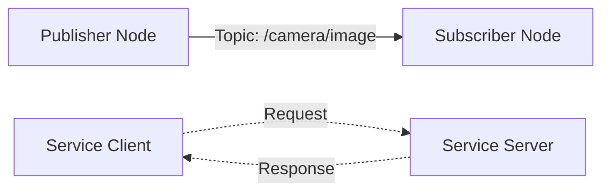

# ROS 2 Fundamentals: The Robotic Nervous System


## What is ROS 2?

ROS 2 (Robot Operating System 2) is not an operating system in the traditional sense (like Windows or Linux). It is a **middleware**—a set of software libraries and tools that help you build robot applications. Think of it as the "nervous system" of the robot.



In a human body, the brain doesn't directly pull on muscle fibers. It sends signals through nerves. Similarly, in a robot, your high-level AI algorithms (the brain) need a standard way to communicate with motors, sensors, and other processes. ROS 2 provides this communication infrastructure.

## Core Concepts

Understanding ROS 2 requires grasping a unique vocabulary.

### 1. The Graph
ROS 2 is a distributed system of processes (Nodes) that communicate over a network (The Graph). These nodes can be on the same computer or distributed across multiple computers (e.g., one on the robot, one on a laptop).

### 2. Nodes
A **Node** is a single executable that performs a specific task.
*   **Example**: One node controls the camera driver. Another node processes the image to find faces. A third node controls the neck motors to look at the face.
*   **Design Principle**: Modular single-purpose nodes are better than one giant monolithic program. If the "face detection" node crashes, the "motor control" node keeps running.

### 3. Topics (Publish/Subscribe)
Topics are the primary way nodes talk to each other. They use a **Publish-Subscribe** model.
*   **Publisher**: A node that sends out data (e.g., "Camera Node" publishes images).
*   **Subscriber**: A node that listens for data (e.g., "Face Detector Node" subscribes to images).
*   **Analogy**: It's like a radio broadcast. The DJ (Publisher) broadcasts music on a frequency (Topic). Anyone tuning in (Subscribers) can hear it. The DJ doesn't know who is listening.

### 4. Services (Request/Response)
Sometimes you need a direct conversation, not a broadcast. **Services** are for synchronous, two-way communication.
*   **Client**: Asks for something.
*   **Server**: Does the work and sends a reply.
*   **Analogy**: Ordering a pizza. You (Client) call the shop (Server) and place an order (Request). You wait heavily until they confirm (Response).

### 5. Actions
Actions are for long-running tasks where you want feedback.
*   **Topic**: "The robot is at x=5, y=5" (Continuous stream).
*   **Service**: "Is the door open?" -> "Yes" (Quick check).
*   **Action**: "Go to the kitchen" (Takes time, might fail, needs progress updates).
    *   *Feedback*: "I am 10% there... 50% there..."
    *   *Result*: "I arrived." or "I am stuck."

## ROS 2 vs ROS 1
Why ROS 2?
1.  **DDS (Data Distribution Service)**: ROS 2 is built on top of industrial-grade real-time communication standards.
2.  **Real-Time**: Better support for real-time systems (critical for balancing a humanoid).
3.  **Security**: ROS 2 supports SROS2 for encryption and authentication.
4.  **No Master Node**: ROS 1 relied on a central "Master". If it died, everything died. ROS 2 is fully distributed/decentralized.

## Installation and Setup

We will be using **ROS 2 Humble Hawksbill** (LTS) on **Ubuntu 22.04**.

```bash
# Set locale
locale  # check for UTF-8

# Setup Sources
sudo apt install software-properties-common
sudo add-apt-repository universe

# Add ROS 2 GPG key with apt.
sudo apt update && sudo apt install curl -y
sudo curl -sSL https://raw.githubusercontent.com/ros/rosdistro/master/ros.key -o /usr/share/keyrings/ros-archive-keyring.gpg

# Install ROS 2 Base
sudo apt install ros-humble-ros-base
```

## Your First ROS 2 Interaction

Let's test the installation strictly from the terminal.

**Terminal 1 (The Talker):**
```bash
source /opt/ros/humble/setup.bash
ros2 run demo_nodes_cpp talker
```

**Terminal 2 (The Listener):**
```bash
source /opt/ros/humble/setup.bash
ros2 run demo_nodes_py listener
```

You should see messages flowing from the C++ node to the Python node! This proves the language-agnostic nature of ROS 2.
