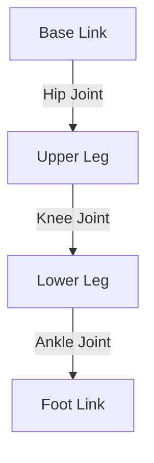

# URDF: The Body of the Robot

To simulate a robot, we need to describe its physical form to the computer. We use **URDF** (Unified Robot Description Format), which is an XML-based language.

## Structure of a Robot

In URDF, a robot is a tree of **Links** connected by **Joints**.



*   **Link**: A rigid body part (e.g., shin, thigh, torso). It has:
    *   **Visual**: What it looks like (mesh, color).
    *   **Collision**: Approximate shape for physics engine (box, cylinder). Simple shapes are faster to calculate.
    *   **Inertial**: Mass and Moment of Inertia matrix. Crucial for balance!
    
*   **Joint**: The hinge or motor connecting links.
    *   **Revolute**: Rotates with limits (e.g., knee).
    *   **Continuous**: Rotates without limits (e.g., wheel).
    *   **Prismatic**: Slides (e.g., linear actuator).
    *   **Fixed**: Rigid connection (e.g., sensor mounted on head).

## Building a Simple Leg

Let's write a URDF for a simple leg.

```xml
<?xml version="1.0"?>
<robot name="simple_leg">

  <!-- Base Link (Hip) -->
  <link name="hip_base">
    <visual>
      <geometry>
        <box size="0.1 0.1 0.1"/>
      </geometry>
      <material name="blue">
        <color rgba="0 0 1 1"/>
      </material>
    </visual>
  </link>

  <!-- Upper Leg Link -->
  <link name="upper_leg">
    <visual>
      <geometry>
        <cylinder length="0.5" radius="0.05"/>
      </geometry>
      <origin rpy="0 0 0" xyz="0 0 -0.25"/> 
      <!-- Shifted down so joint is at top -->
    </visual>
    <collision>
      <geometry>
        <cylinder length="0.5" radius="0.05"/>
      </geometry>
      <origin rpy="0 0 0" xyz="0 0 -0.25"/>
    </collision>
    <inertial>
      <mass value="1.0"/>
      <inertia ixx="0.1" ixy="0" ixz="0" iyy="0.1" iyz="0" izz="0.1"/>
    </inertial>
  </link>

  <!-- Hip Joint -->
  <joint name="hip_joint" type="revolute">
    <parent link="hip_base"/>
    <child link="upper_leg"/>
    <origin xyz="0 0 0"/>
    <axis xyz="0 1 0"/> <!-- Rotates around Y axis -->
    <limit lower="-1.57" upper="1.57" effort="30" velocity="1.0"/>
  </joint>

</robot>
```

## XACRO: Cleaning up the XML

Raw URDF gets repetitive. **XACRO** (XML Macros) allows us to use variables and math.

```xml
<xacro:property name="leg_length" value="0.5" />
<xacro:property name="leg_radius" value="0.05" />

<xacro:macro name="create_leg" params="prefix reflect">
    <link name="${prefix}_leg">
        ...
    </link>
</xacro:macro>

<xacro:create_leg prefix="left" reflect="1" />
<xacro:create_leg prefix="right" reflect="-1" />
```

This is essential for humanoids, where the left side is a mirror of the right side.

## Visualizing in Rviz2

Before simulating physics, we verify the geometry in **Rviz (ROS Visualization)**.

1.  **robot_state_publisher**: A ROS node that reads the URDF and publishes the transformation of every link (`/tf` topic).
2.  **joint_state_publisher_gui**: A handy tool with sliders to manually move joints and see if they rotate correctly.

```bash
ros2 launch urdf_tutorial display.launch.py model:=my_leg.urdf
```

## Common Pitfalls in URDF

1.  **Inertia Matrix Errors**: If you guess the inertia matrix (e.g., using I=1 for everything), the physics engine (Gazebo) will explode. The robot will jitter and fly into space. You must calculate proper inertia based on mass and shape.
2.  **Origin Confusion**: Understanding precise coordinate frames (where is Z-up? where is Forward-X?) is critical. Standard ROS convention: X is Forward, Y is Left, Z is Up (Right Hand Rule).
3.  **Self-Collision**: Ensure you define collision meshes so the robot doesn't walk through its own legs.

In the next module, we will spawn this URDF into a physics world (Gazebo) and make it fall over!
