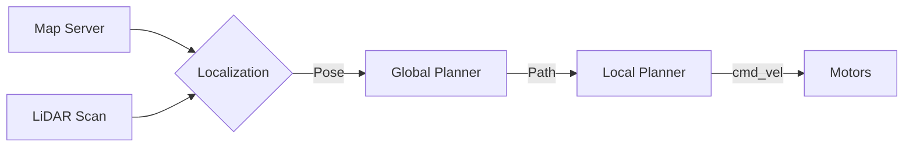

# Navigation (Nav2): Moving with Purpose

**Nav2** is the heir to the ROS Navigation Stack. It answers two questions:
1.  "Where am I?" (**Localization**)
2.  "How do I get there?" (**Path Planning**)

## The Challenges for Humanoids
Nav2 was designed for wheeled robots (TurtleBot). Humanoids are distinct:
*   They don't roll; they step.
*   They can step *over* small obstacles.
*   They can climb stairs.

Standard Nav2 treats everything as a 2D Costmap. For humanoids, we often need **3D Voxel Maps**.

## The Navigation Pipeline



### 1. Map Server
Loads a map (usually a 2D occupancy grid `.pgm` file) into memory.

### 2. AMCL (Adaptive Monte Carlo Localization)
This is a particle filter.
*   The robot starts with 1000 hypotheses (particles) of where it *might* be.
*   It reads the LiDAR scan. "I see a wall 2m away."
*   It checks the map. "Where on the map is there a wall 2m away?"
*   It keeps the particles that match and kills the ones that don't.
*   Eventually, the particles converge on the true location.

### 3. Global Planner
"I am in the kitchen. I want to go to the bedroom."
*   Algorithm: **A* (A-Star)** or **Dijkstra**.
*   Output: A high-level path (a line of waypoints).

### 4. Local Planner (Controller)
"I need to follow this line, but there is a cat in the way."
*   Algorithm: **DWB (Dynamic Window Approach)** or **MPPI (Model Predictive Path Integral)**.
*   Output: Velocity commands (`cmd_vel`). 
    *   For wheeled robots: `linear.x` and `angular.z`.
    *   For humanoids: Walking velocity vector.

### 5. Recovery Behaviors
"I am stuck."
*   **Spin**: Look around.
*   **Back up**: Try to reverse.
*   **Wait**: Maybe the obstacle (person) will move.

## Configuring Nav2 for Humanoids

We need to tune the **Costmap**.
*   **Inflation Radius**: Don't get too close to walls.
*   **Footprint**: The shape of the robot. A simple circle is often enough, but a polygon is better.

### 3D Navigation
For traversing stairs, we replace the 2D Costmap with an Octomap or Voxel Grid. We use planners that understand height (Z-axis).

**Isaac ROS Nvblox** builds a 3D costmap on the GPU, allowing us to spot hanging obstacles (like a table edge at head height) that a 2D LiDAR at knee-height would miss.

## Practical Example
To launch Nav2:
```bash
sudo apt install ros-humble-navigation2 ros-humble-nav2-bringup
ros2 launch nav2_bringup bringup_launch.py map:=/path/to/my_map.yaml
```

You can then give a "2D Nav Goal" in Rviz by clicking on the map. The robot (simulation) should plan a path and follow it.
