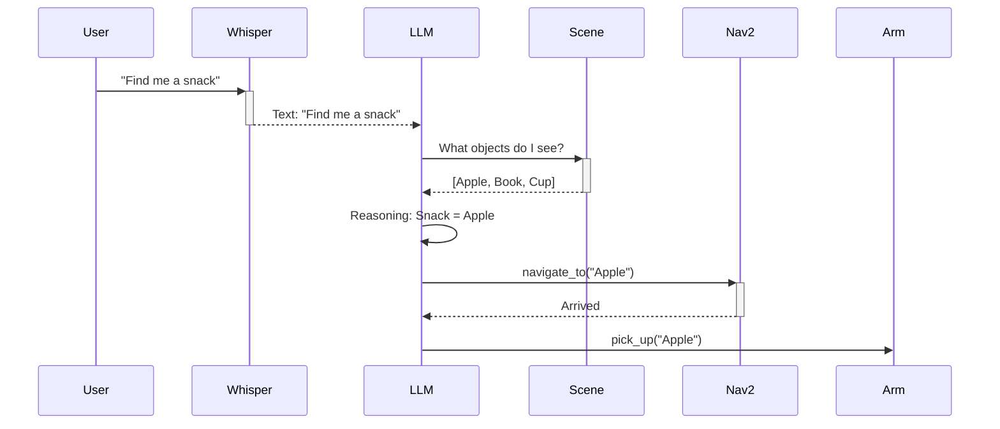

# Vision-Language-Action Models (VLA): The Cognitive Layer

We have a body (ROS 2), a world (Gazebo), and a brain that can navigate (Nav2). Now we need a **Mind**—something that understands intent.

## The Semantic Gap
*   **Traditional Robotics**: Knows "Move to x=5, y=10". Does NOT know "Go to the kitchen."
*   **LLMs (Large Language Models)**: Know what a "kitchen" is, and that "food" is usually found there.

Bridging this gap is the goal of VLA.




## Voice as an Interface
We start with speech.
**OpenAI Whisper** is the state-of-the-art for Speech-to-Text (ASR). It runs fast on GPUs.

```python
import whisper
model = whisper.load_model("base")
result = model.transcribe("audio.mp3")
print(result["text"]) # "Go to the kitchen and find me a snack."
```

## From Text to ROS Actions
How do we turn "Find me a snack" into `cmd_vel`?

### 1. The Prompt Engineering Approach
We can give an LLM (like GPT-4o or Llama 3) a list of available ROS Actions as tools.

**System Prompt**:
> You are a robot assistant. You have the following tools:
> - `navigate_to(location_name)`
> - `scan_for_objects()`
> - `pick_up(object_name)`
> 
> The user says: "Find me a snack."
> Plan a sequence of actions.

**LLM Output**:
> 1. `navigate_to("kitchen")`
> 2. `scan_for_objects()`
> 3. `pick_up("apple")`

### 2. End-to-End VLA Models (RT-2, PaLM-E)
Google's RT-2 (Robotic Transformer) is a model trained on both internet text/images AND robot trajectory data. It outputs direct robot actions (effector tokens) instead of just text.
*   Input: Image of a desk + Text "Pick up the extinct animal".
*   Output: The robot arm moves to the plastic dinosaur.

This is "Embodied Reasoning". The model understands "extinct animal" = "dinosaur" and connects it to the visual pixels of the dinosaur toy.

## Implementation Details

We will build a simple "Cognitive Node" in Python.
1.  **Listener**: Subscribes to `/voice_command`.
2.  **Thinker**: Sends text to an LLM API (OpenAI or Local Llama via Ollama).
3.  **Executor**: Parses the LLM's JSON response and calls ROS 2 Action Servers.

```python
# executor_node.py
def execute_plan(plan):
    for step in plan:
        if step['action'] == 'navigate':
            nav_client.send_goal(step['target'])
        elif step['action'] == 'pick':
            manipulation_client.send_goal(step['object'])
```

## Safety and Hallucination
LLMs hallucinate. You do NOT want a robot to hallucinate a command like "Jump out the window."
*   **Guardrails**: Code layers that sanity-check the LLM's output.
*   **Grounding**: Verifying that the object "apple" actually exists in the visual scene before trying to grab it.

In the capstone, we will put this all together.
